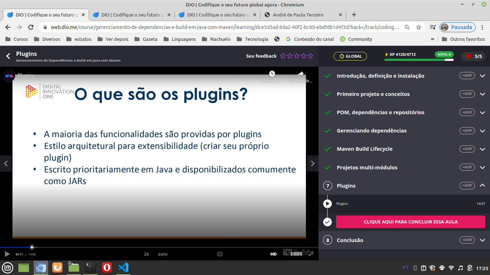
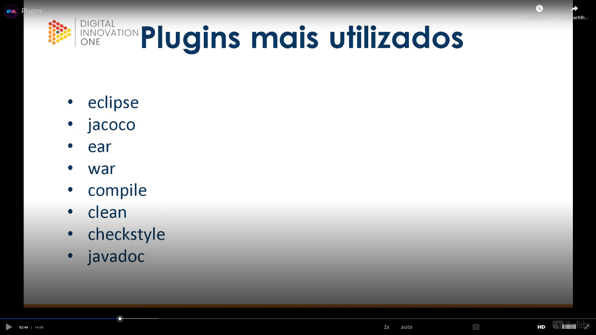
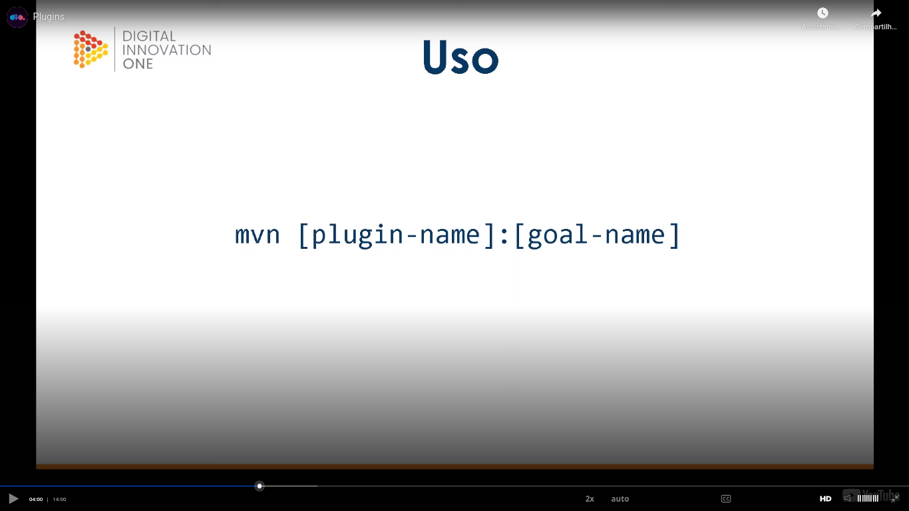
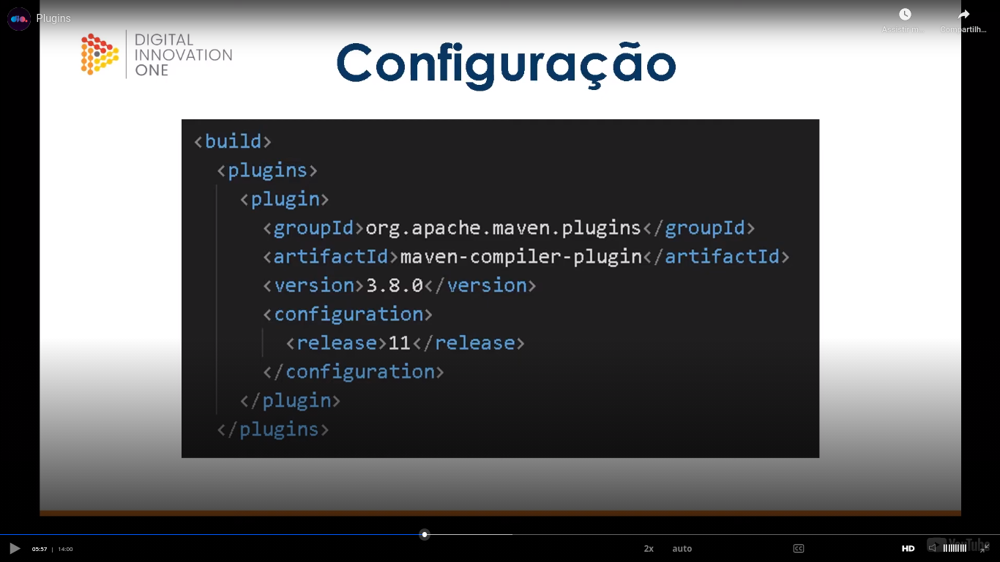

# General

[class](https://web.dio.me/course/gerenciamento-de-dependencias-e-build-em-java-com-maven/learning/dce5d3ad-6da2-40f2-bc80-ebdfdb1d4f3d?back=/track/coding-the-future-claro-java-spring-boot&tab=undefined&moduleId=undefined).

General things about plugins:



Most used plugins:



How o use a plugin:



Example:

```
mvn dependency help
```

Plugin configuration:



At start some comfiguration is the same as the configurations of a dependency:

- groupId;
- artifactId;
- version.