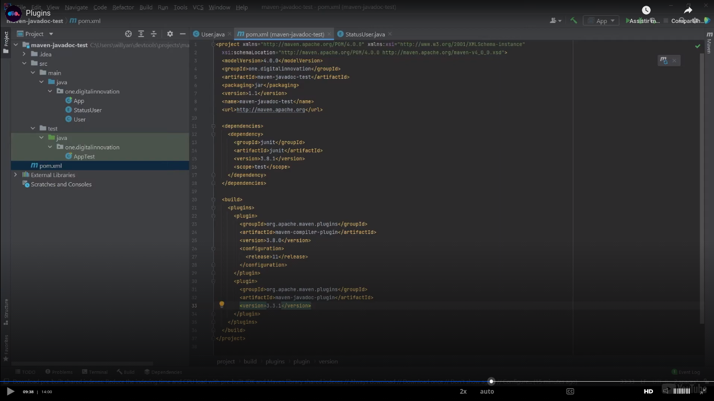
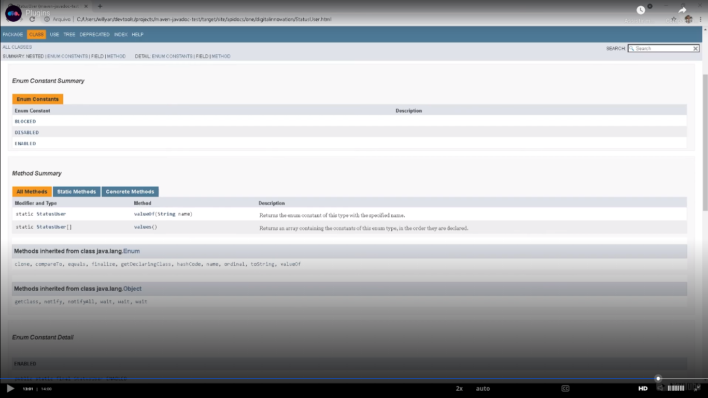

# Message

To be clear. The content here is a content based on a free course. Noone can reproduce this material. If you wanna to know this material, my advice is to you access the **free** [course](https://web.dio.me/track/coding-the-future-claro-java-spring-boot). And if they end the course or start to ask money to study in the course? Well, this considerations are out of my control, but the DIO material is excelent and the course is amazing! If you acquire a DIO paln, you will have access to amazing courses.


# General

[class](https://web.dio.me/course/gerenciamento-de-dependencias-e-build-em-java-com-maven/learning/dce5d3ad-6da2-40f2-bc80-ebdfdb1d4f3d?back=/track/coding-the-future-claro-java-spring-boot&tab=undefined&moduleId=undefined).

General things about plugins:


Most used plugins:


How o use a plugin:


Example:

```
mvn dependency help
```

## Plugin configuration


At start some comfiguration is the same as the configurations of a dependency:

- groupId;
- artifactId;
- version.

After, we can have configurations related specifically the plugin that is be configured. Example of configuration: `release` (please see the image).

## Example of generation of a Javadoc

First of all, please install one plugin. Insert this plugin in `pom.xml`: `maven-javadoc-plugin`.



Then execute:

```
mvn javadoc:javadoc
```

At this time you already need to have the `Javadoc` comments in the right places.

The content will be generated in the folder "`target`".

Example of generated `javadoc`:


